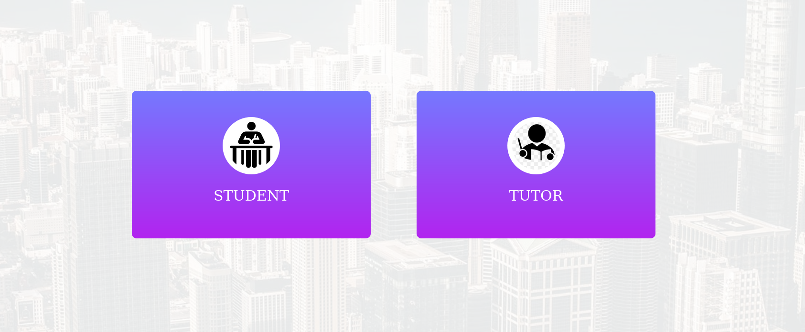
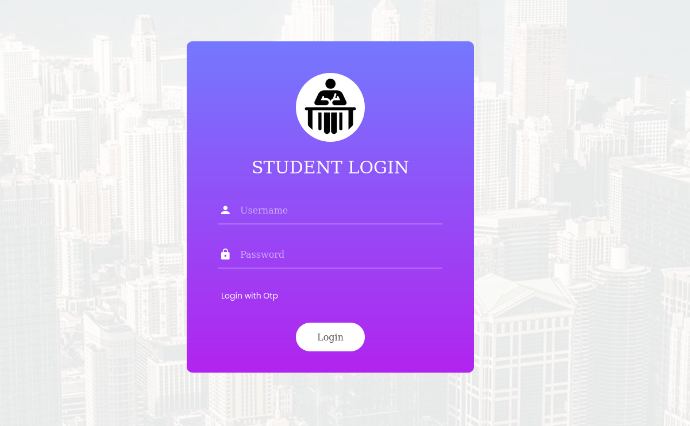

# classroom-management-system

## About 
This is a web created for a school classroom automation

- It is divided into three sections Teacher Students Admin. The admin can add teachers and students. 
- Teachers can edit their profile, add students and edit their profiles
- Teachers can add learning videos and students will automatically record attendance based on the viewing.
- Teachers can be given assignments and marks can be given by checking the assignment submitted by the students
- The teacher has the option to post the announcement and evans
- Students have the option to view classes and submit notes and assignments
- Students can view the events posted and register for the event

Students and teachers have the option to log in with their email id and password as well as login using the OTP coming to their mobile.

## URL
https://myeclassoom.herokuapp.com
